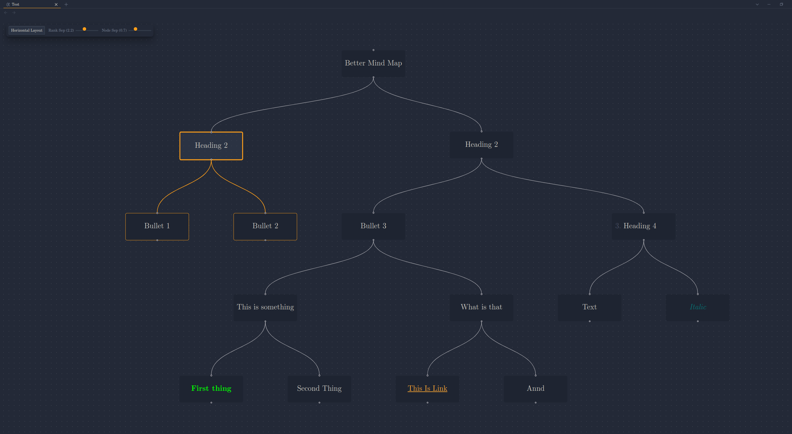
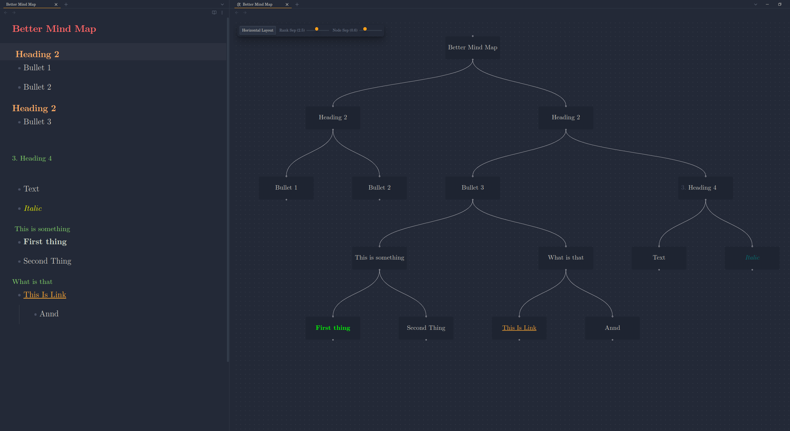

# Better Mindmap for Obsidian

Visualize your Markdown outlines as interactive, dynamic mind maps within Obsidian. This plugin provides enhanced navigation, layout customization, and spacing controls directly within the mind map view.

## Features

- **Visualize Markdown Outlines:** Automatically generates a mind map from the heading structure / bullet points of your active Markdown file.
- **Live Updates:** The mind map automatically updates to reflect the content of the currently active Markdown note as you edit / navigate within Obsidian.
- **Interactive Layouts:**
  - Toggle between **Vertical (Top-to-Bottom)** and **Horizontal (Left-to-Right)** layouts using the in-view control panel.
  - View automatically fits to content after layout changes.
- **Dynamic Spacing Controls:**
  - Adjust **Rank Separation** (space between levels) using an interactive slider.
  - Adjust **Node Separation** (space between nodes on the same level) using an interactive slider.
  - See layout changes applied instantly.
- **In-View Control Panel:** Access layout and spacing adjustments directly within the mind map view without navigating away.
- **Node Interaction:**
  - **Collapse/Expand:** Double-click nodes to collapse or expand their children.
  - **Selection Highlight:** Click a node to highlight it and its descendants.
- **Note Navigation:** Click links within node text (if they are standard Markdown links) to navigate to other notes.
- **Themed Interface:** Controls utilize Obsidian theme variables for seamless visual integration.

## How to Use

1.  **Open the Mind Map:**
    - Ensure a Markdown file is open and active.
    - Run the command `Better Mindmap: Open Mind Map View` from the command palette (Ctrl/Cmd+P). This will typically open the mind map in a new pane.
2.  **Interact with the Map:**
    - **Pan & Zoom:** Use standard mouse/trackpad gestures to navigate the canvas.
    - **Collapse/Expand:** Double-click a node.
    - **Select:** Single-click a node.
    - **Follow Links:** Click on standard Markdown links within node text.
3.  **Use the Control Panel (Top-Left):**
    - **Layout:** Click the `Switch to Horizontal/Vertical Layout` button to toggle the orientation.
    - **Spacing:** Use the `Rank Sep` and `Node Sep` sliders to dynamically adjust the spacing between nodes.
4.  **Reset View State:**
    - Run the command `Better Mindmap: Reset Mind Map View` to clear selection highlights and uncollapse all nodes.
5.  **Center View:**
    - Run the command `Better Mindmap: Center Mind Map View` to fit the entire mind map within the current viewport.

## Installation

### From Community Plugins (Recommended)

1.  Ensure Obsidian's Community Plugins are enabled (`Settings` -> `Community Plugins` -> `Turn on community plugins`).
2.  Click `Browse` community plugins.
3.  Search for "Better mind map".
4.  Click `Install`.
5.  Once installed, click `Enable`.

### Manual Installation

1.  Download the latest `main.js`, `manifest.json`, and `styles.css` files from the [Releases](https://github.com/linem-davton/obsidian-better-mindmap/releases) page of this repository.
2.  Navigate to your Obsidian vault's plugins folder: `VaultFolder/.obsidian/plugins/`.
3.  Create a new folder named `better-mindmap`.
4.  Copy the downloaded `main.js`, `manifest.json`, and `styles.css` into the `better-mindmap` folder.
5.  Reload Obsidian (Ctrl/Cmd+R).
6.  Enable the "Better Mindmap" plugin under `Settings` -> `Community Plugins`.

## Configuration

Most configuration is handled directly via the **In-View Control Panel** (layout direction, spacing).

For advanced users, the spacing sliders control the following CSS variables on the root element (`:root` or `html`). You can set base values for these in your own Obsidian CSS snippets if desired, although the panel sliders will override them during interaction:

- `--mindmap-ranksep-multiplier`: Multiplies the node height to determine rank separation.
- `--mindmap-nodesep-multiplier`: Multiplies the node width to determine node separation.

## Commands

The following commands are available via the Obsidian Command Palette (Ctrl/Cmd+P):

- **`Better Mindmap: Open Mind Map View`**: Opens the mind map for the currently active Markdown file.
- **`Better Mindmap: Reset Mind Map View`**: Clears selection and uncollapses all nodes in the active mind map view.

## Contributing

Contributions, issues, and feature requests are welcome. Please check the [Issues](https://github.com/linem-davton/obsidian-better-mindmap/issues) page before submitting a new one.

## License

This plugin is released under the [MIT License](LICENSE).
